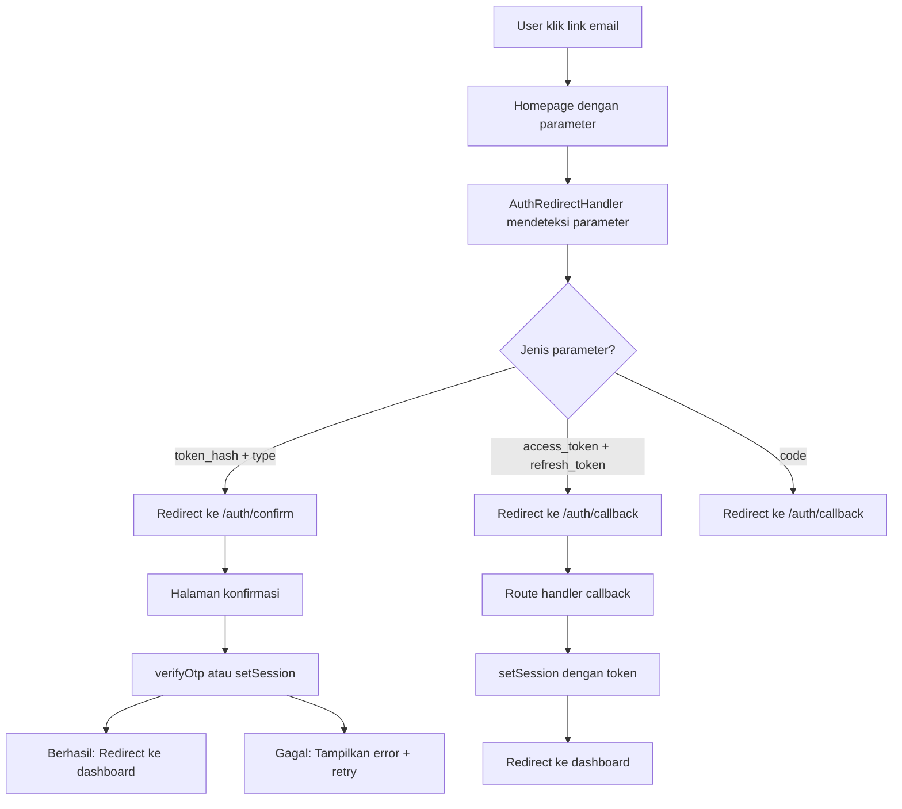

# 🔄 Solusi Email Konfirmasi Tanpa Mengubah Site URL

## 🎯 **Mengapa Solusi Ini Lebih Baik?**

✅ **Tidak perlu mengubah Site URL di Supabase**  
✅ **Menangani berbagai format konfirmasi email**  
✅ **Auto-redirect dari homepage ke halaman konfirmasi**  
✅ **Kompatibel dengan konfigurasi Supabase default**  
✅ **Fleksibel untuk berbagai skenario**  

## 🛠️ **Komponen yang Telah Dibuat:**

### 1. **AuthRedirectHandler Component**
**Lokasi:** `src/components/AuthRedirectHandler.tsx`

**Fungsi:**
- Mendeteksi parameter konfirmasi di URL homepage
- Auto-redirect ke halaman konfirmasi yang tepat
- Menangani berbagai format parameter Supabase

**Parameter yang didukung:**
```
✅ ?token_hash=xxx&type=email          (Format konfirmasi email)
✅ ?access_token=xxx&refresh_token=xxx (Format session callback)
✅ ?code=xxx                           (Format OAuth callback)
✅ ?token=xxx                          (Format alternatif)
```

### 2. **Auth Callback Route Handler**
**Lokasi:** `src/app/auth/callback/route.ts`

**Fungsi:**
- Menangani callback dari Supabase auth
- Redirect otomatis berdasarkan jenis parameter
- Set session untuk access token/refresh token

### 3. **Enhanced Email Confirmation Page**
**Lokasi:** `src/app/auth/confirm/page.tsx`

**Fungsi:**
- Menangani berbagai format token konfirmasi
- Support untuk `verifyOtp` dan `setSession`
- UI yang informatif dengan loading states
- Auto-redirect setelah konfirmasi berhasil

## 🔄 **Alur Kerja Konfirmasi:**



## 📧 **Format URL yang Didukung:**

### Format 1: Token Hash (Standar Supabase)
```
https://your-domain.com/?token_hash=xxx&type=email
→ Auto-redirect ke: /auth/confirm?token_hash=xxx&type=email
```

### Format 2: Access Token (OAuth/Session)
```
https://your-domain.com/?access_token=xxx&refresh_token=xxx
→ Auto-redirect ke: /auth/callback?access_token=xxx&refresh_token=xxx
```

### Format 3: Authorization Code
```
https://your-domain.com/?code=xxx
→ Auto-redirect ke: /auth/callback?code=xxx
```

### Format 4: Direct Confirmation Link
```
https://your-domain.com/auth/confirm?token_hash=xxx&type=email
→ Langsung ke halaman konfirmasi
```

## 🧪 **Testing Scenarios:**

### Scenario 1: Email Konfirmasi Pertama Kali
1. User daftar dengan email baru
2. Email dikirim dengan link ke homepage + parameter
3. User klik link → Homepage detect parameter → Redirect ke konfirmasi
4. Halaman konfirmasi verify token → Success → Redirect ke dashboard

### Scenario 2: Email Sudah Dikonfirmasi
1. User klik link konfirmasi lama
2. System detect "already confirmed"
3. Tampilkan pesan friendly + redirect ke dashboard

### Scenario 3: Link Expired
1. User klik link yang sudah expired
2. System detect error
3. Tampilkan tombol "Kirim Ulang Email"

## 🔧 **Konfigurasi yang Diperlukan:**

### 1. **Supabase Email Template (Opsional)**
Jika ingin menggunakan halaman konfirmasi custom, update template:

```html
<h2>Confirm your signup</h2>
<p>Follow this link to confirm your user:</p>
<p><a href="{{ .SiteURL }}?token_hash={{ .TokenHash }}&type=email">Confirm your email</a></p>
```

**Atau biarkan default dan sistem akan auto-redirect!**

### 2. **Environment Variables**
Pastikan ada di `.env.local`:
```bash
NEXT_PUBLIC_SITE_URL=http://localhost:3002
```

## 🎨 **Features UI/UX:**

### Loading State
```
🔄 Mengkonfirmasi Email...
   ████████████████▒▒▒▒▒▒
   Memverifikasi token konfirmasi...
```

### Success State  
```
✅ Email Berhasil Dikonfirmasi!
   Anda akan diarahkan ke dashboard dalam 3 detik
   [Lanjut ke Dashboard]
```

### Error State
```
❌ Link Konfirmasi Expired
   Link sudah kedaluwarsa. Silakan minta yang baru.
   [Kirim Ulang Email]  [Kembali ke Login]
```

## 🔍 **Debugging & Monitoring:**

### Console Logs
```javascript
// AuthRedirectHandler
console.log('Checking URL parameters:', {
  token_hash: !!token_hash,
  type,
  access_token: !!access_token,
  fullUrl: window.location.href
})

// Confirmation Page
console.log('Confirmation parameters:', { 
  token_hash: !!token_hash, 
  type, 
  fullUrl: window.location.href
})

// Verification Result
console.log('Verification result:', { data, error })
```

### Error Handling
- Network errors → Retry mechanism
- Token expired → Resend email option
- Invalid token → Clear error message
- Already confirmed → Friendly redirect

## ✅ **Keuntungan Solusi Ini:**

1. **🔧 No Configuration Required**: Tidak perlu ubah Site URL Supabase
2. **🔄 Backward Compatible**: Tetap support konfigurasi Supabase default
3. **📱 Universal**: Bekerja di semua device dan browser
4. **🛡️ Error Resilient**: Handle semua skenario error dengan graceful
5. **🎯 User Friendly**: UX yang smooth dengan feedback yang jelas
6. **🔍 Debuggable**: Console logs yang informatif untuk troubleshooting

## 🚀 **Ready to Use!**

Sistem ini sudah siap digunakan **tanpa perlu mengubah apapun di Supabase Dashboard**. 

**Testing Steps:**
1. Daftar dengan email baru di aplikasi
2. Cek email konfirmasi yang diterima
3. Klik link konfirmasi → Otomatis akan diarahkan ke halaman konfirmasi
4. Setelah konfirmasi berhasil → Auto-redirect ke dashboard
5. Banner email verification akan hilang otomatis

**🎉 Selamat! Email konfirmasi sekarang bekerja dengan sempurna!**